# 💼 MERN LinkedIn Clone


A **full-stack LinkedIn-style social platform** built using the **MERN stack**, featuring **secure authentication**, **user profiles**, **post feeds**, and **social networking features**.

---

## 🔗 Live Demo

* 🌐 **Frontend (Vercel)**: [https://tap-academy-two.vercel.app/](https://tap-academy-two.vercel.app/)
* ⚙️ **Backend (Render - Free Tier)**: *(may take time to wake up)*

---

## 📸 Screenshots

---

### 🏠 Landing Page

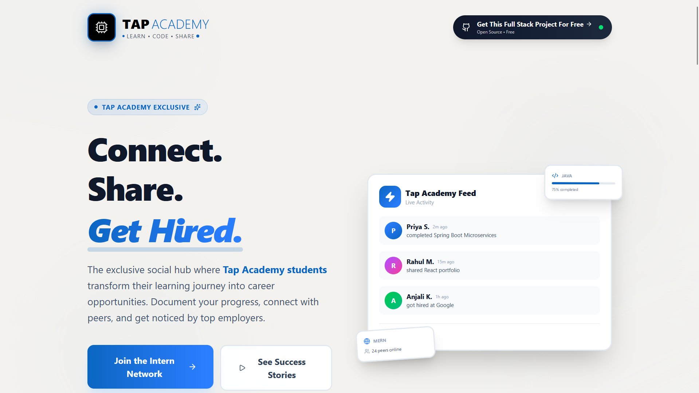
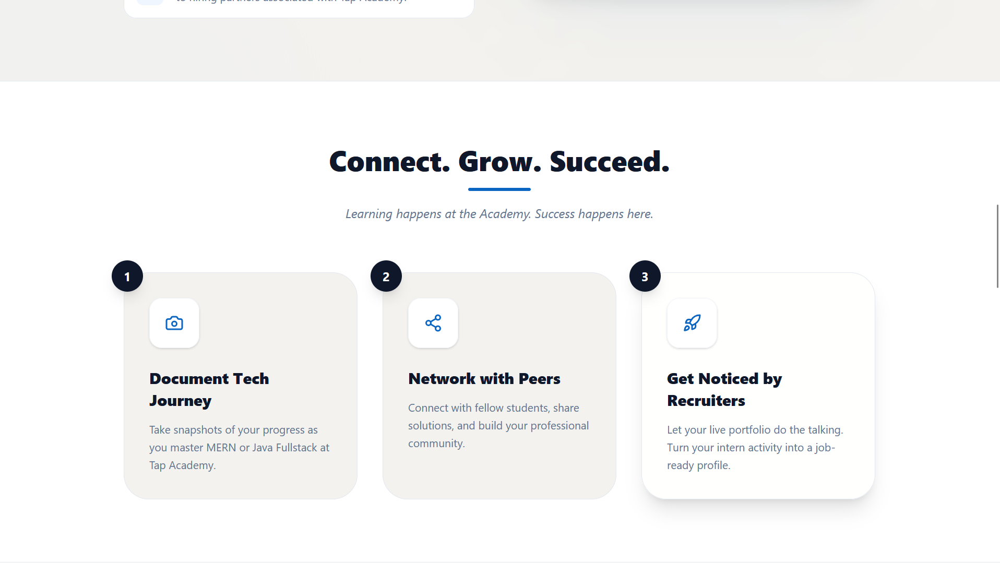

---

### 🔐 Authentication

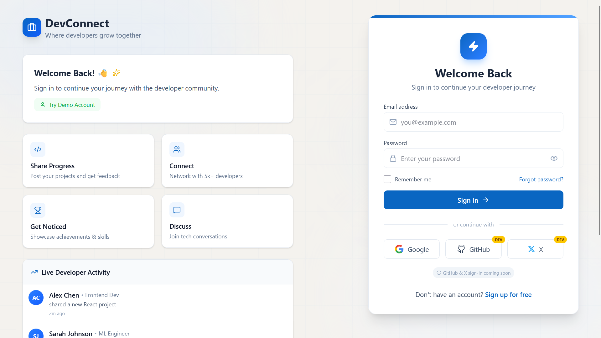
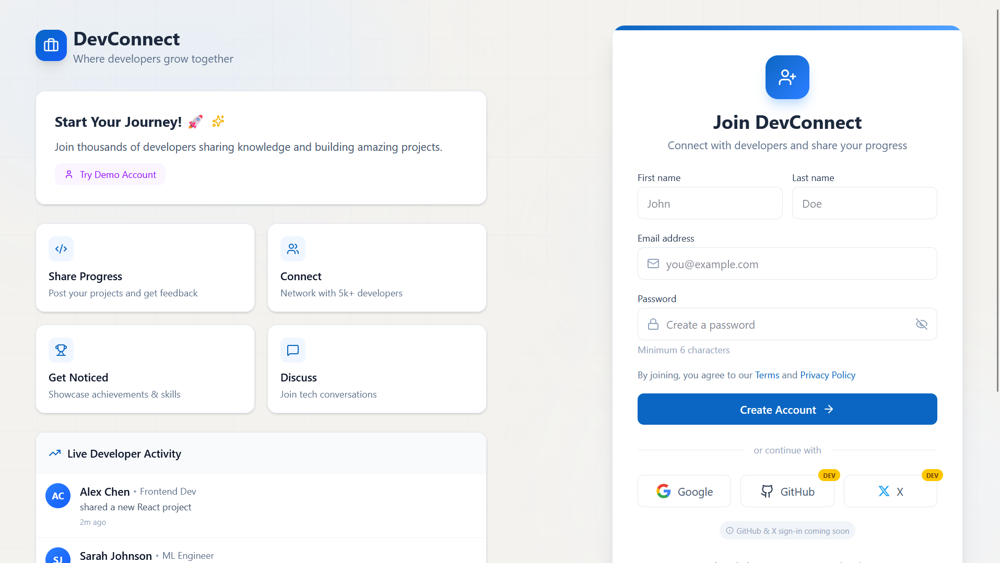

---

### 📰 Feed

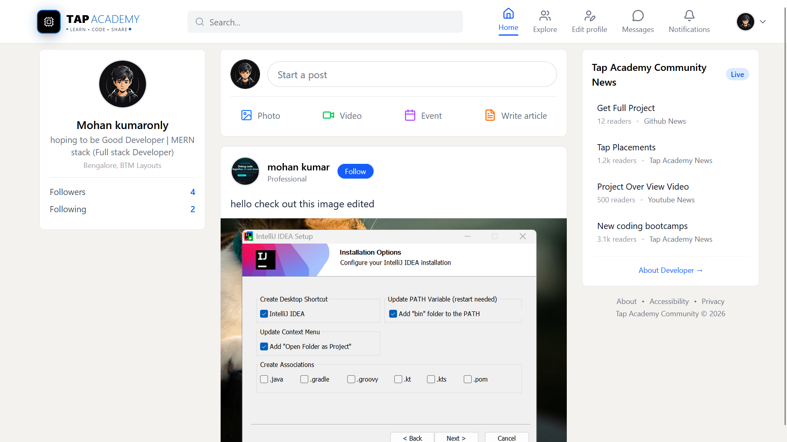
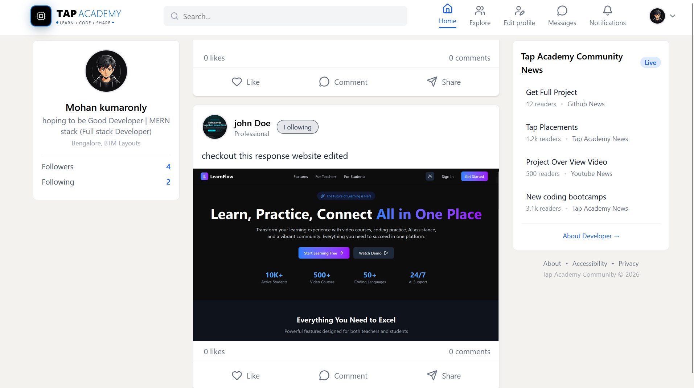

---

### 👤 Profile

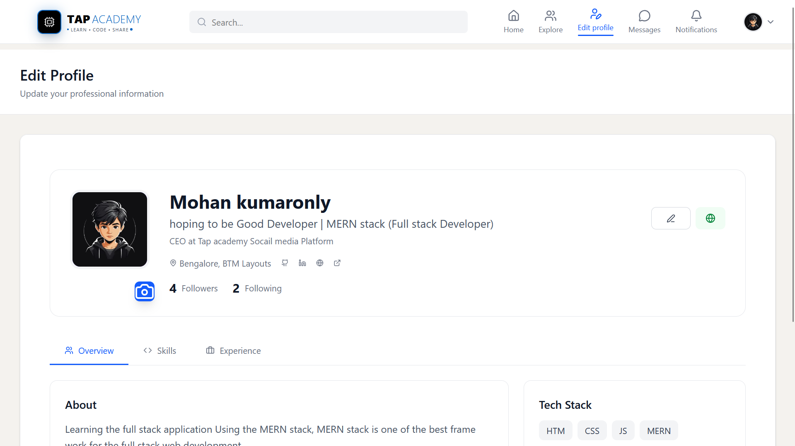
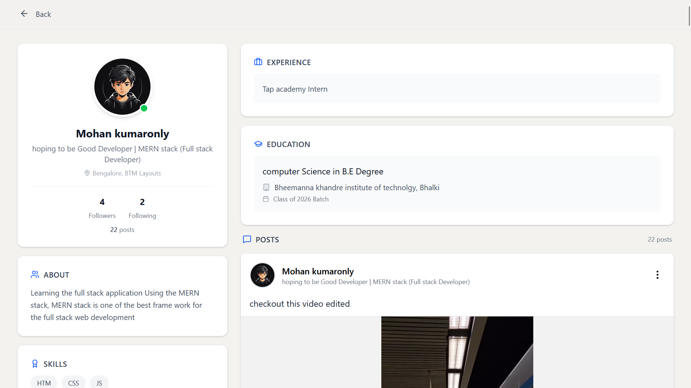

---

### 🌍 Explore Users

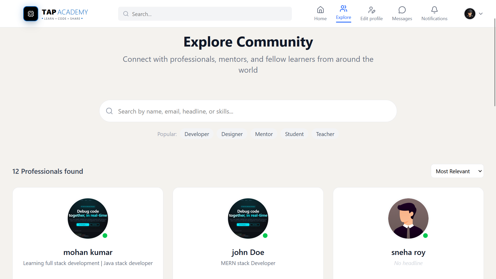

---

### 🔔 Notifications

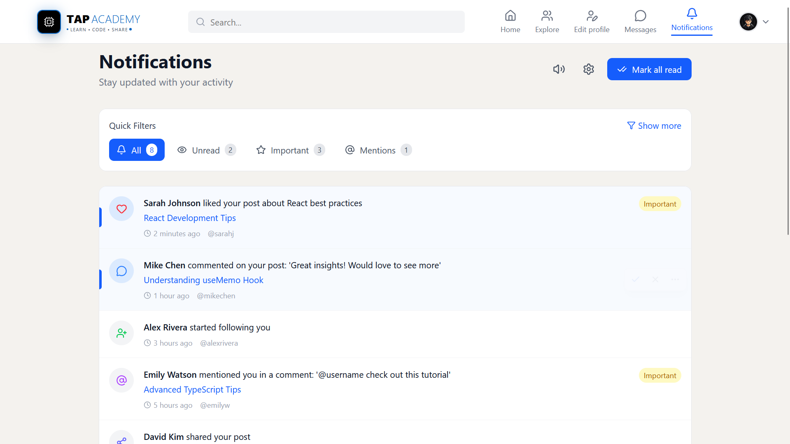

---

### ⚙️ Settings

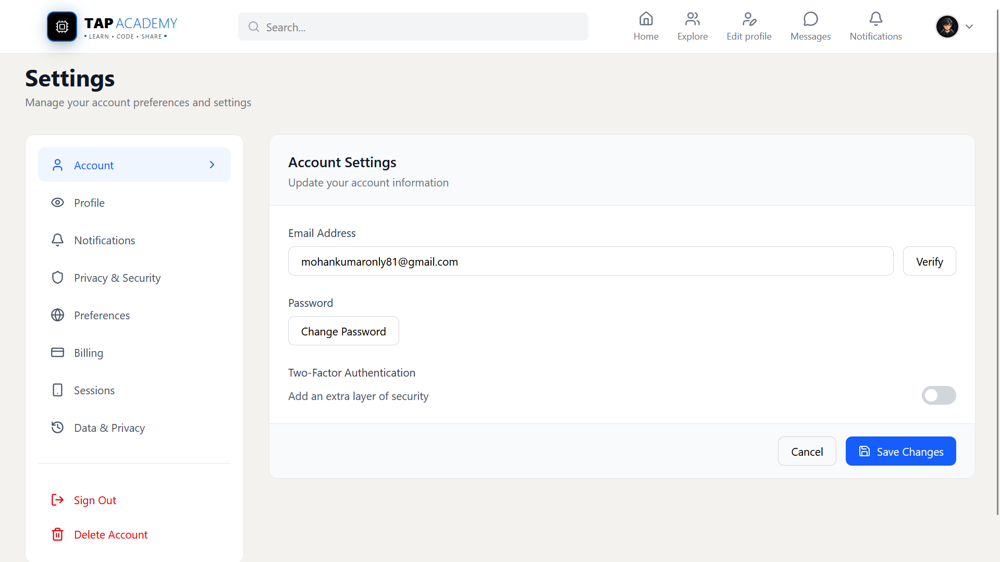

---

### 💬 Chat (🚧 Work in Progress)

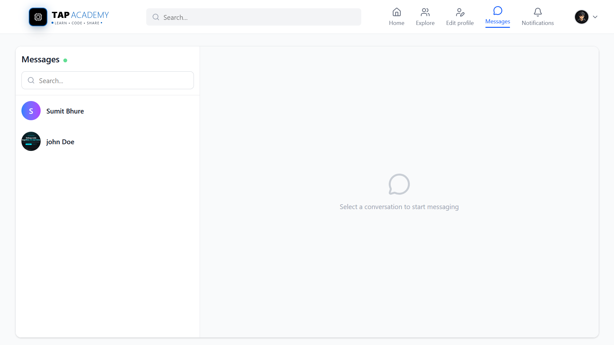

---

## 🧠 Project Overview

This project replicates **core LinkedIn functionalities**, focusing on:

* Secure authentication system
* User profile management
* Feed-based content sharing
* Social graph (follow/unfollow)
* Scalable and modular architecture

---

## 🚀 Features

---

### 🔐 Authentication (✅ Production Ready)

> 🔁 Reused from:
> 👉 [https://github.com/mohankumaronly/Authentication_using_MERN](https://github.com/mohankumaronly/Authentication_using_MERN)

* Email + Password login
* Google OAuth 2.0
* JWT Access & Refresh Tokens
* HTTP-only cookie-based authentication
* Email verification system
* Forgot / Reset password flow
* Persistent login (`/me`)
* Secure logout & token rotation

---

### 👤 Profile System (✅)

* Create & update profile
* Upload avatar (Cloudinary)
* Public / private profile visibility
* View other users' profiles

---

### 📰 Posts & Feed (✅)

* Create post
* Edit & delete post
* Like posts
* Global feed
* User-specific posts

---

### 🤝 Social Features (✅)

* Follow / Unfollow users
* Followers / Following list
* Connection statistics

---

### 💬 Comments (🚧)

* Partially implemented

---

### 💬 Realtime Chat (🚧)

* Backend structure ready
* WebSocket integration in progress

---

## 🧱 Tech Stack

---

### 🖥️ Backend

* Node.js + Express
* MongoDB + Mongoose
* JWT Authentication
* Google OAuth 2.0
* Cloudinary (media uploads)
* Nodemailer / Brevo (emails)
* Rate Limiting + Security Middleware

---

### 🌐 Frontend

* React (Vite)
* React Router v6
* Context API
* Axios (interceptors)
* Tailwind CSS

---

### ⚙️ DevOps & Deployment

* Docker & Docker Compose
* Render (Backend - Free Tier)
* Vercel (Frontend)
* Nginx (Frontend container)

---

## 🔐 Authentication Flow

```text
Login / OAuth
→ Access Token (httpOnly cookie)
→ Refresh Token (stored in DB + cookie)
→ Access expires
→ Silent refresh (/refresh-token)
→ Retry request
```

---

## 📂 Project Structure

---

### 📦 Backend

```text
backend/
│── server.js
│── package.json
│── Dockerfile
│── Dockerfile.dev
│── .env
│
├── configuration/
│   └── db.js
│
├── middlewares/
│   ├── rate.limiter.js
│   └── token.verification.js
│
├── modules/
│   ├── auth/
│   │   ├── controllers/
│   │   ├── models/
│   │   ├── routers/
│   │   └── validators/
│   │
│   ├── profile/
│   │   ├── controllers/
│   │   ├── models/
│   │   ├── middlewares/
│   │   └── routers/
│   │
│   ├── posts/
│   │   ├── controllers/
│   │   ├── models/
│   │   ├── middlewares/
│   │   └── routes/
│   │
│   └── chat/   (WIP)
│       ├── controllers/
│       ├── models/
│       └── routes/
│
└── utils/
    ├── cloudinary.js
    ├── sendEmail.js
    └── Emails/
```

---

### 🎨 Frontend

```text
frontend/
│── Dockerfile
│── Dockerfile.dev
│── vite.config.js
│── vercel.json
│
├── public/
│   └── assets
│
└── src/
    │── App.jsx
    │── main.jsx
    │
    ├── assets/
    ├── common/
    ├── components/
    ├── context/
    │   └── AuthContext.jsx
    │
    ├── Hooks/
    ├── layouts/
    │   └── LayoutComponents/
    │
    ├── pages/
    │   ├── Auth/
    │   ├── Home/
    │   ├── posts/
    │   ├── payment/ (not used)
    │   └── NotFound/
    │
    ├── Routers/
    │   └── AppRouters.jsx
    │
    └── services/
        ├── api.js
        ├── auth.service.js
        ├── post.service.js
        ├── profile.service.js
        └── chat.service.js
```

---

## 🐳 Docker Setup

### Development

```bash
docker-compose -f docker-compose.dev.yml up --build
```

### Production

```bash
docker-compose up --build
```

---

## 🧪 Running Locally

```bash
git clone https://github.com/your-username/linkedin-clone.git
cd linkedin-clone

# Backend
cd backend
npm install
npm run dev

# Frontend
cd frontend
npm install
npm run dev
```

---

## 🔒 Security Highlights

* HTTP-only cookies (XSS protection)
* Refresh token rotation
* Rate limiting
* Secure OAuth flow
* Input validation

---

## 🚧 Roadmap

* ✅ Authentication
* ✅ Profiles
* ✅ Posts
* 🚧 Comments
* 🚧 Chat (WebSockets)
* ⏳ Notifications improvements
* ⏳ Search system

---

## ⭐ Key Highlights

* 🔐 Production-ready authentication system
* 🧱 Modular backend architecture
* ⚡ Clean & scalable frontend
* 🐳 Dockerized setup (dev + prod)
* 🌐 Fully deployed (Render + Vercel)

---

## 👨‍💻 Author

**Mohan Kumar**

---

## 📜 License

MIT License
